# System Architecture - With Mermaid Diagrams

## Overview

This document describes the architecture of the Salesforce CRM Integration system with visual diagrams.

## Architecture Diagram

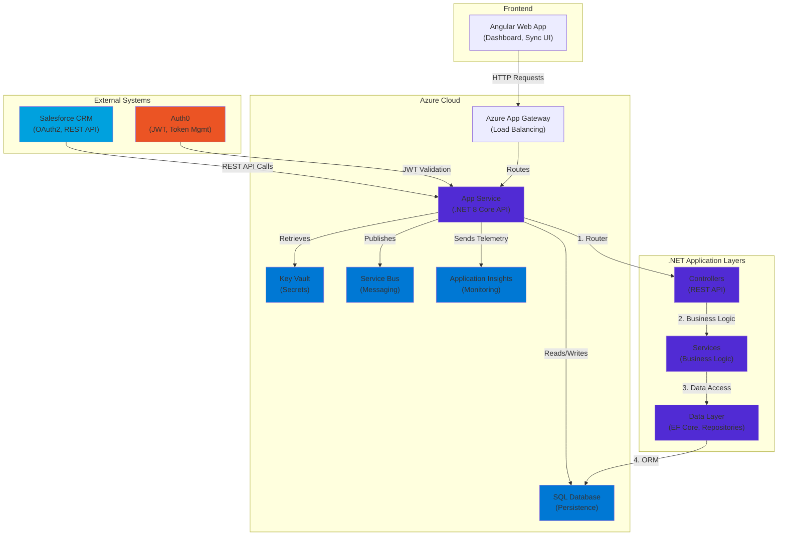

## Data Flow Sequence

### Sync From Salesforce Process

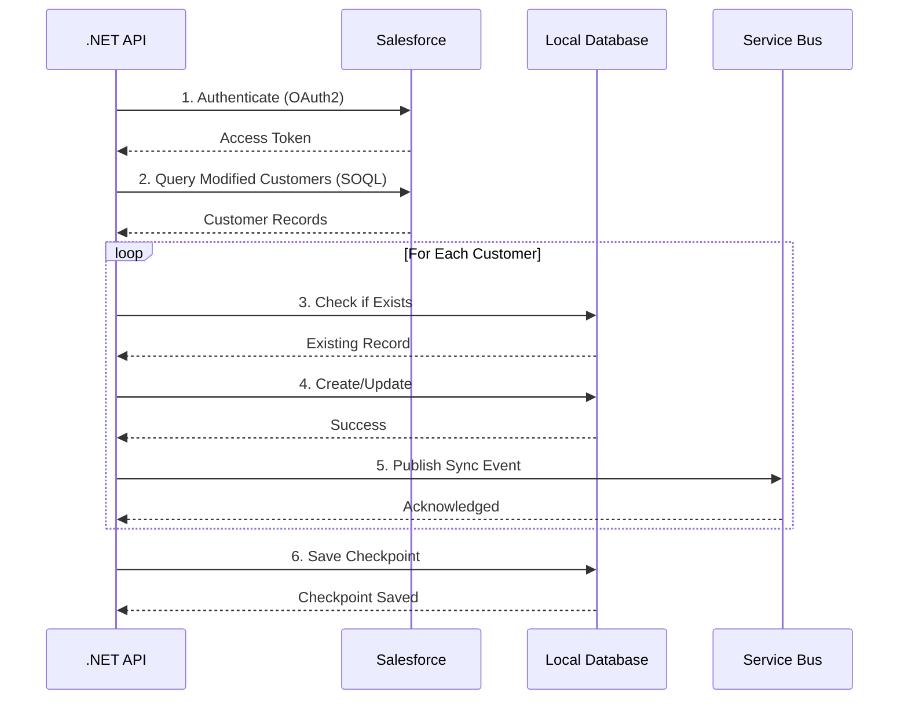

## Sync To Salesforce Process

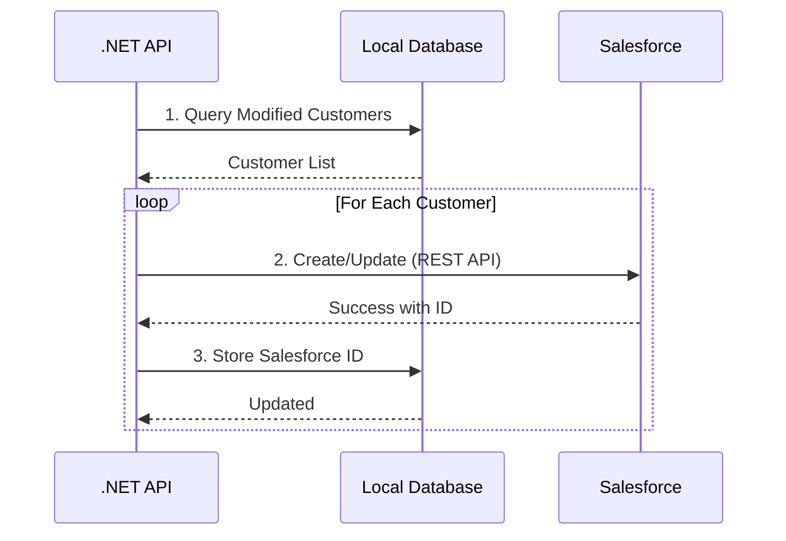

## Request/Response Flow

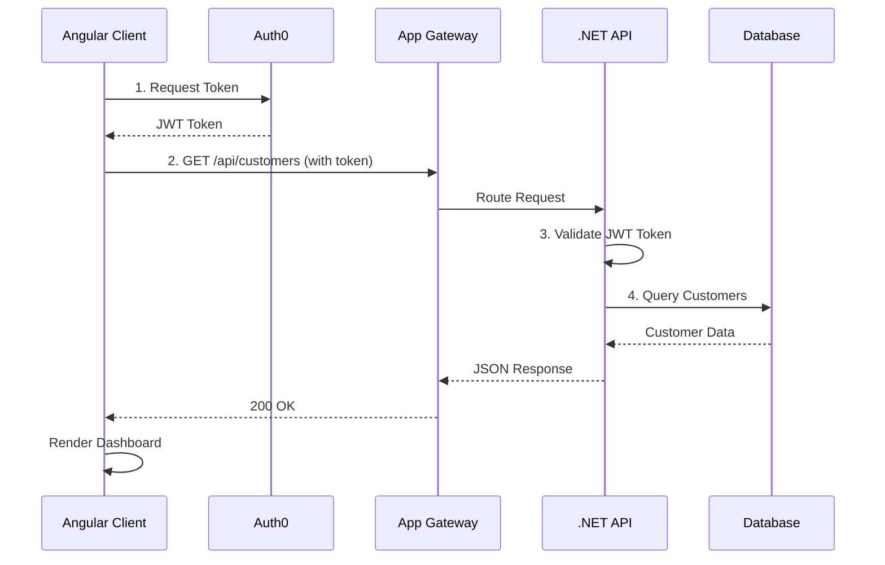

## Dependency Injection Graph

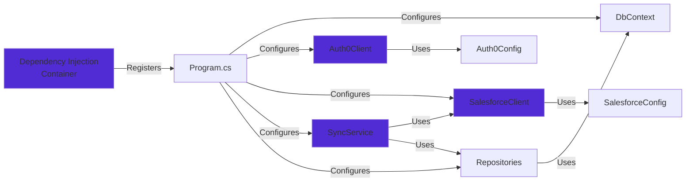

## Error Handling Flow

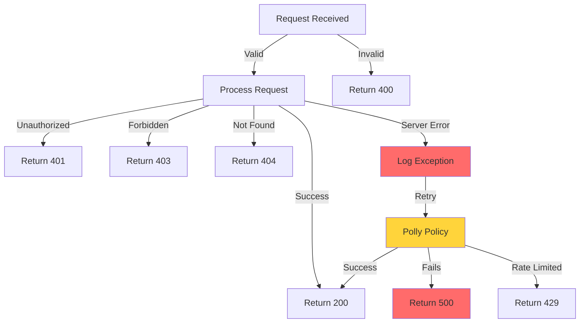

## State Machine - Sync Operation

```mermaid
stateDiagram-v2
    [*] --> Idle
    
    Idle -->|Trigger Sync| Authenticating
    Authenticating -->|Token Obtained| Querying
    Querying -->|Data Retrieved| Processing
    
    Processing -->|Success| Checkpointing
    Processing -->|Failure| ErrorHandling
    
    ErrorHandling -->|Recoverable| Retry
    ErrorHandling -->|Unrecoverable| MarkFailed
    
    Retry -->|Success| Checkpointing
    Retry -->|Still Failing| MarkFailed
    
    Checkpointing -->|Saved| Completed
    MarkFailed -->|Logged| Completed
    Completed --> Idle
    
    note right of Processing
        Batches customers
        Validates data
        Saves to DB
        Publishes events
    end
    
    note right of ErrorHandling
        Logs error
        Records failure
        Determines action
    end
```

## Database Schema

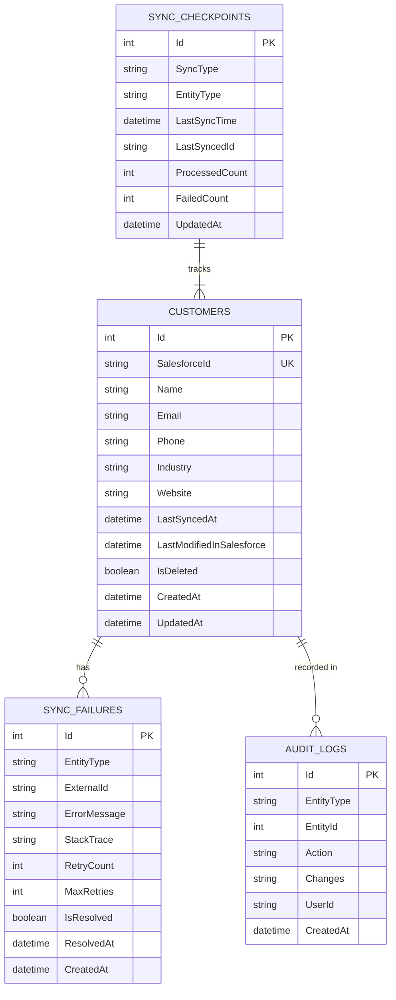

## Authentication Flow - Auth0

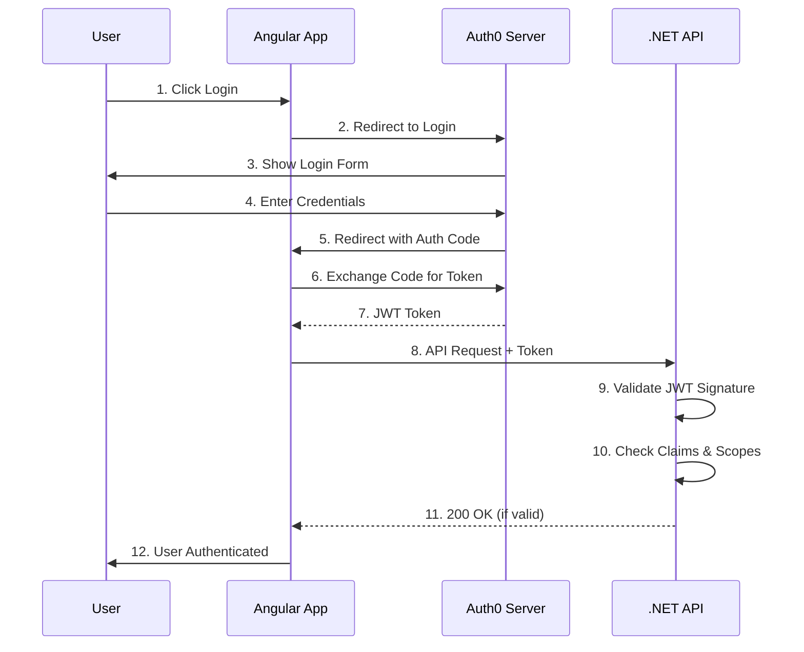

## Deployment Architecture

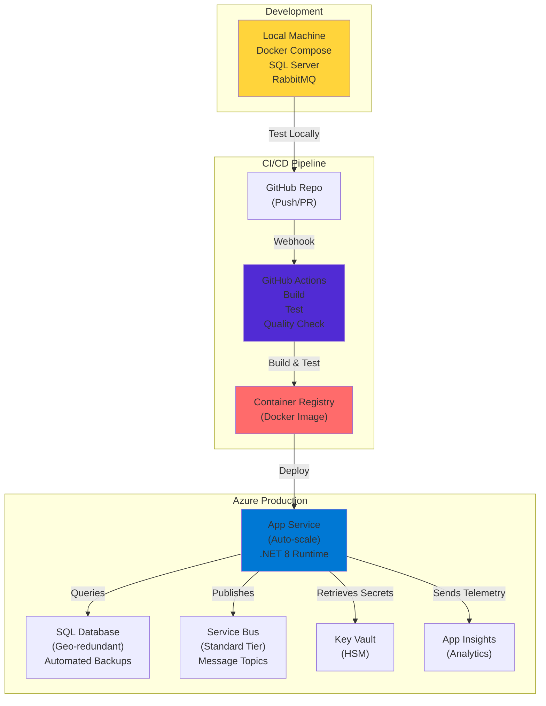

## Class Hierarchy

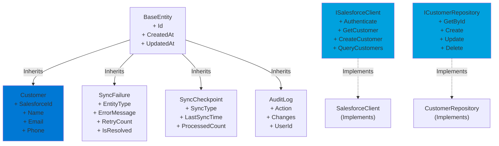

## Load Balancing & Scaling

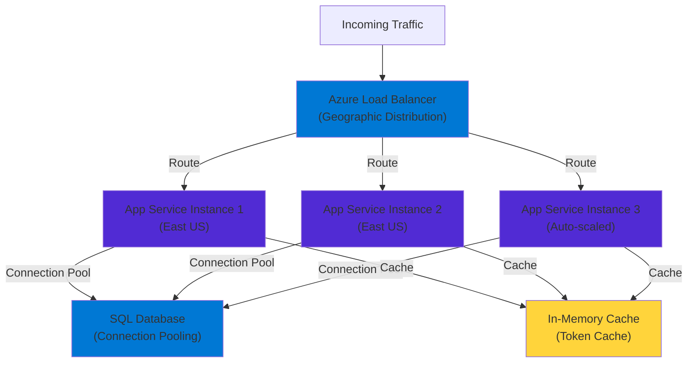

## Component Interactions

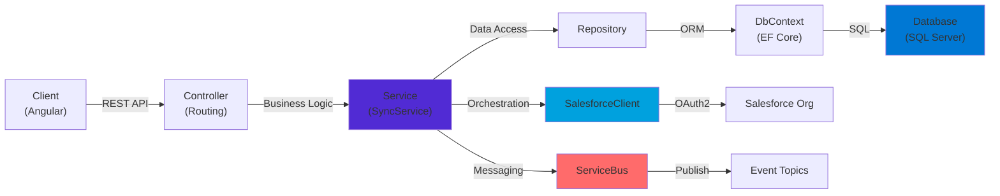

---

**Key Takeaways:**

1. **Layered Architecture**: Clear separation of concerns (Controllers → Services → Data)
2. **Resilience**: Multiple retry mechanisms and error handling
3. **Scalability**: Horizontal scaling with load balancing
4. **Security**: Key Vault for secrets, JWT for auth
5. **Observability**: Application Insights for monitoring
6. **Cloud-Native**: Leverages Azure managed services
